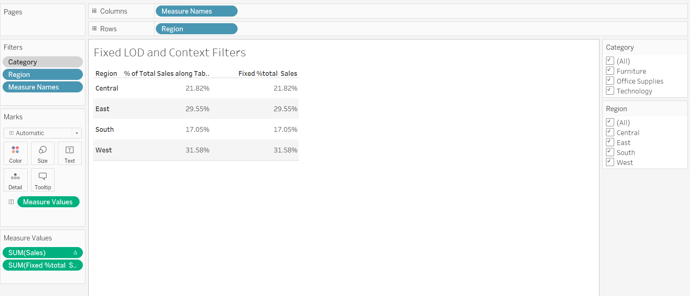
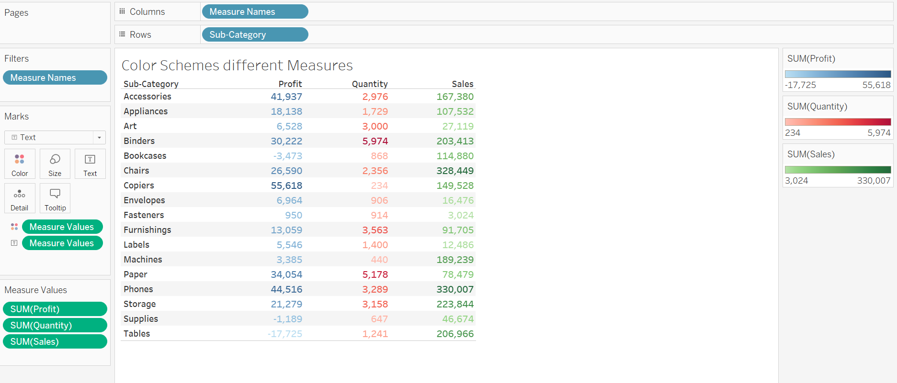
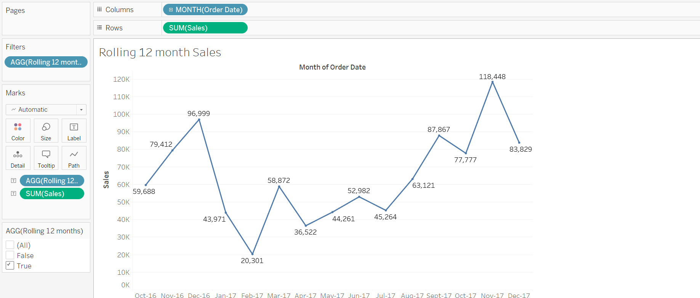
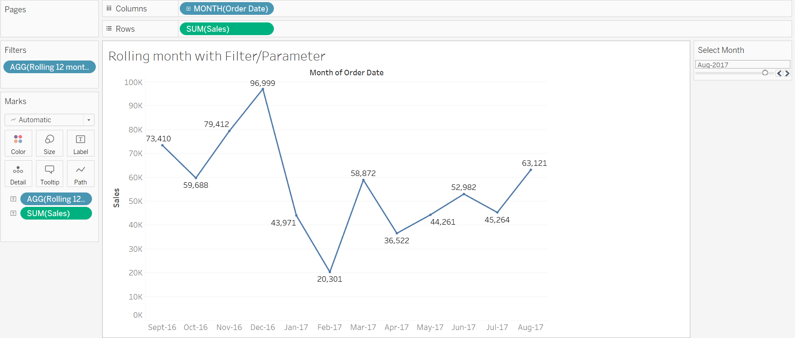

# Tableau_Superstore-Data-Analysis

This Tableau workbook contains 5 sheets with demonstrate various functionalities like LOD Expressions, Sets, Context filters, Colour schemes and Rolling Months as shown below:

1. Top and Bottom Profitable Products

2. Fixed LOD and Context Filters

3. Color Schemes different Measures

4. Rolling 12 month Sales

5. Rolling 12 month sales using Parameter

